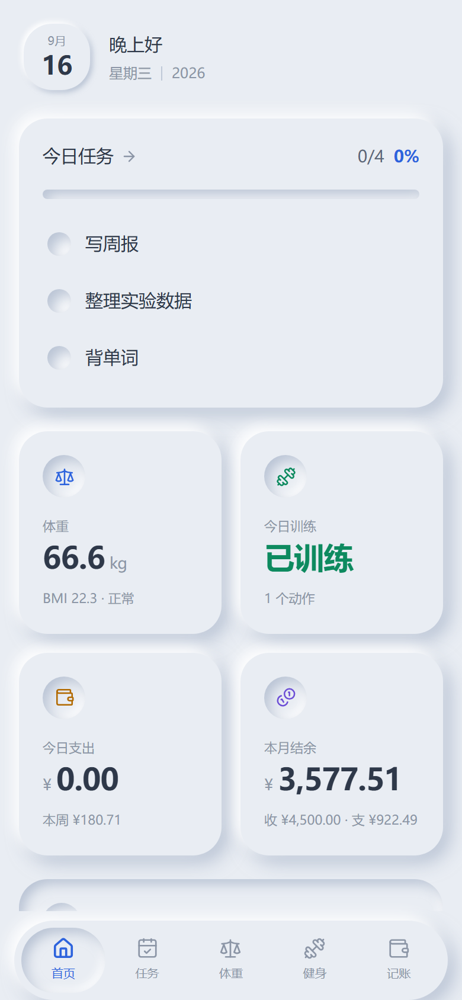
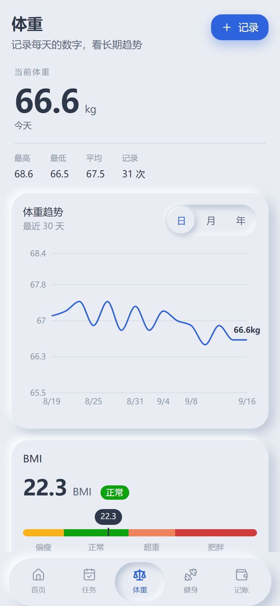
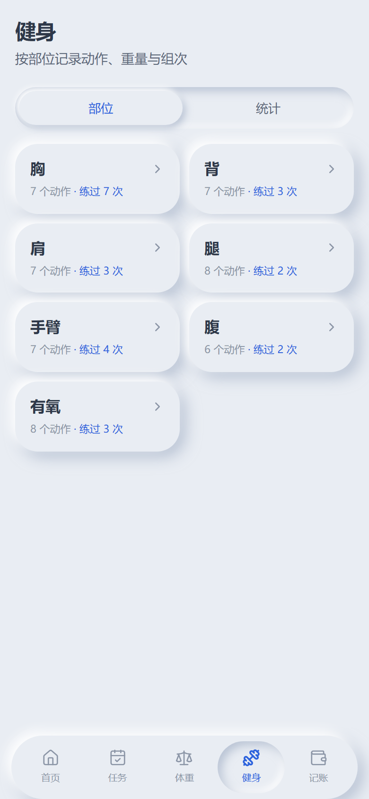
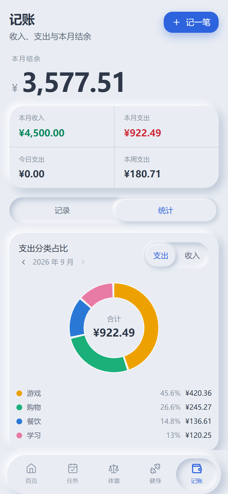
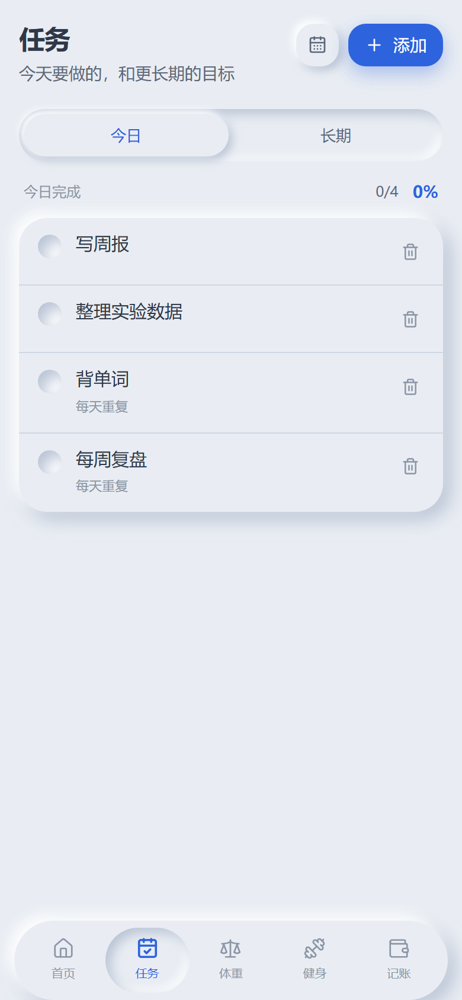
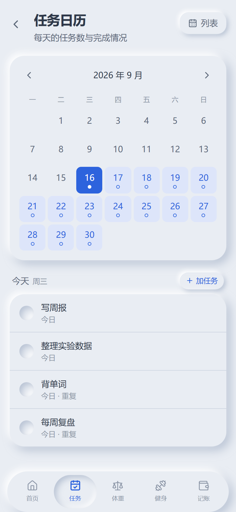
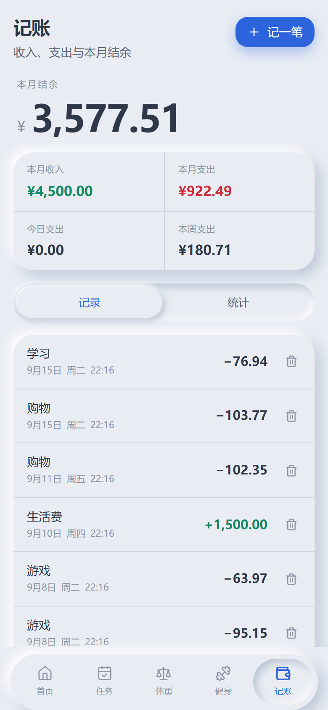
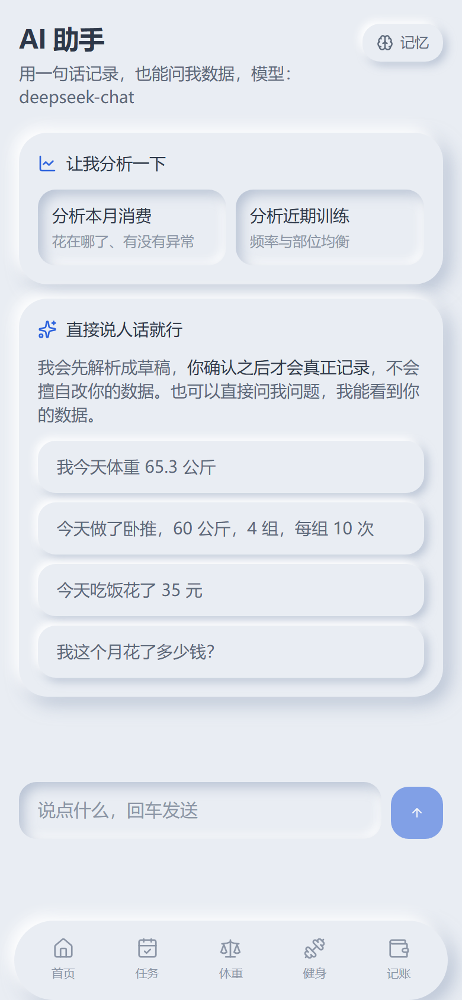

<div align="center">


# 煦雨工作台

**把任务、体重、健身、记账收进一个入口，让 AI 帮你看出它们之间的联系。**

移动端优先 · 可安装到手机主屏 · 数据完全自己掌控

[功能](#功能) · [技术栈](#技术栈) · [本地跑起来](#本地跑起来) · [部署到手机](#部署到手机) · [常见问题](#常见问题)

</div>

---

## 它解决什么问题

大多数人的日常数据是**散落**的：待办在一个 App、体重在另一个、训练记在备忘录、账目在第三个 App。

于是你看得到每个数字，却看不出它们之间的关系 ——

> 这几天没睡好，所以训练重量上不去，所以心情差，所以多花了几笔钱。

这些联系需要把数据放在一起才能发现，而这正是这个工作台想做的事：

```
任务 + 体重 + 健身 + 财务
        ↓  写入同一个数据库
      仪表盘（今日控制中心）
        ↓  把当天快照交给 DeepSeek
   总结 + 建议 + 行动
```

## 适合谁

- **有健身习惯的人** —— 想知道「这个动作比上次进步了多少」，而不只是记一串数字
- **在意日常开销的人** —— 想看清钱花在哪，而不是月底对不上账
- **想给自己一段不被打断的时间的人** —— 自习室记下每天真正专注了多久，而不是「今天好像学了一会儿」
- **想要一个地方管住所有事的人** —— 受够了在四个 App 之间来回切
- **在意数据归属的人** —— 所有数据存在你自己的数据库里，AI 的 Key 也只在你自己手上

不适合：需要多人协作、需要云端同步账号体系、想要开箱即用的商业 App 的场景。

## 功能

<table>
<tr>
<td width="25%"></td>
<td width="25%"></td>
<td width="25%"></td>
<td width="25%"></td>
</tr>
<tr>
<td align="center">首页：今日控制中心</td>
<td align="center">体重：趋势与 BMI 刻度</td>
<td align="center">健身：按部位记录</td>
<td align="center">记账：分类占比</td>
</tr>
<tr>
<td width="25%"></td>
<td width="25%"></td>
<td width="25%"></td>
<td width="25%"></td>
</tr>
<tr>
<td align="center">任务：今日与长期</td>
<td align="center">日历：点某天加任务</td>
<td align="center">记账：本月收支</td>
<td align="center">AI 助手：说话就能记</td>
</tr>
</table>

### 仪表盘 —— 今日控制中心

当前日期、今日任务与完成率、今日体重、今日训练、今日支出、本月收支结余，以及一段 AI 今日总结。四张卡片的数字全部来自真实数据库，**没有数据时显示空状态，不画假图**。

### 体重

每天记一次，看趋势。提供日 / 月 / 年三种粒度的趋势图，以及一条 **BMI 直线刻度尺** —— 标出偏瘦 / 正常 / 超重 / 肥胖四个区间，把你的 BMI 落在尺上，并给出对应身高的健康体重范围。

> 本项目**刻意不设「目标体重」**。当前体重永远是你最新录入的那一条，不做目标差值。想判断体重是否合适，看 BMI 刻度尺。

### 健身

按 **胸 / 背 / 肩 / 腿 / 手臂 / 腹 / 有氧** 七个部位记录。每次记录动作、重量、组数、次数。

保存时会自动和**上一次同动作**对比，直接告诉你结论：

```
上次：卧推 60kg × 10
这次：卧推 62.5kg × 8
     → 重量较上次提升 2.5kg
```

还有每周 / 每月训练次数、各部位训练分布、总训练量、个人最佳（PR）。

有氧没有「重量×次数」，走时长与距离。

### 记账

收入与支出分开记。支出分类：餐饮 / 交通 / 购物 / 游戏 / 学习 / 住房 / 其他；收入分类：生活费 / 工资 / 其他。分类可以自己加。

显示今日支出、本周支出、本月收入 / 支出 / 结余，并提供分类占比环形图、每日消费趋势、每月消费趋势。占比图可以**翻到任意月份**查看。

### 任务

今日任务、长期任务、重复任务（每天 / 每周），完成 / 取消完成、编辑、删除。日历视图里点某一天就能直接加那天的任务。

**长期任务不会混进今日任务** —— 它是一份待办清单，不占日历格子。

### 自习室

设定一段时长、写下这一场要学的东西，然后倒计时。走满算完成，**中途只有一次暂停机会** —— 机会用掉之后你再按暂停，这一场就直接判失败。

**提前学完可以主动结束**，一样记成功，但至少要学满 1 分钟。**时长一律按实际学的时间记**：计划 45 分钟、学了 12 分钟就结束，当天记的是 12 分钟，不是 45。

倒计时的权威在**服务端**：开始时刻由后端落库，剩余时间按真实时钟推算，客户端只负责把服务端给的秒数画出来，所以改手机时间没有用。切到别的 App、锁屏、关掉页面都不算中断，时间照走，回来时按服务端时间续算 —— 这一条是刻意放宽的（代价是「开始之后立刻关掉，过一小时再打开」也会记成成功，单人自用可以接受）。

入口在**首页右上角**，不占底部导航的位置（和「任务」同一处理）。这个模块**不进 AI 那条链路**，只自己统计：今日专注时长、完成与失败次数、成功率，以及最近 30 天的每日时长。

### AI 助手

这是让四个模块真正连起来的部分。它做三件事：

**1. 用一句话记录。** 直接说人话：

```
我今天体重 65.3 公斤
今天做了卧推，60 公斤，4 组，每组 10 次
今天吃饭花了 35 元
提醒我每天背单词
```

模型把它解析成**草稿**，你在界面上点确认之后才会真正写进数据库。确认前数据库不会有任何变化，点「不用了」也不会留下痕迹。

**2. 记住关于你的事。** 聊天中如果你透露了长期有效的信息（身高、健身目标、饮食偏好、作息习惯），它会问你要不要记住。确认后进入你的「画像」，之后**每次生成总结都会参考它**。

效果差别很大 —— 同样是体重上涨：

| 没有画像 | 有了「正在增肌，目标 70kg」的画像 |
|---|---|
| 「体重 63.5kg，比上次涨了 0.5kg，注意控制。」 | 「体重涨了 0.5kg，**离 70kg 的目标还有距离，这个上涨趋势是好事**，但速度偏慢。增肌光靠吃不够，建议安排力量训练并补足蛋白质。」 |

记忆是**永久**的，可以在「AI 助手 → 记忆」里查看和删除；而聊天上下文**每天重置**，不让昨天的话题拖到今天。

**3. 分析你的数据。** 可以直接问「我这个月花了多少」「和上个月比怎么样」「我最近训练情况如何」，它会读你的真实数据回答，数据不足时也会如实说，不编造。

---

## 技术栈

### 前端
| | |
|---|---|
| 框架 | React 19 + TypeScript 5.9 |
| 构建 | Vite 8 |
| 样式 | Tailwind CSS 4（CSS-first 配置，无 `tailwind.config.js`） |
| 路由 | React Router 7（路由级懒加载，图表库只在需要时下载） |
| 图表 | Recharts + 自绘 SVG（BMI 刻度尺） |
| 状态 | Zustand |
| PWA | vite-plugin-pwa |

### 后端
| | |
|---|---|
| 语言 | Java 17 |
| 框架 | Spring Boot 3.5 |
| ORM | MyBatis-Plus 3.5（单表 CRUD 走 `BaseMapper`，复杂统计写 XML） |
| 安全 | Spring Security + JWT（无状态） |
| 数据库 | MySQL 8 |
| AI | DeepSeek API |

### 设计语言

**轻拟物（soft neumorphism）**：凸起和凹陷的块与底色同色，立体感全部来自一明一暗两道光影，全站**没有一根边框**。四档阴影（`xs` / `sm` / 默认 / `lg`）分别对应小图标、按钮、卡片、弹层。

整套视觉由 `frontend/src/index.css` 里的 CSS 变量驱动，改配色和阴影只需要动那一处。

> 拟物最常见的毛病是对比度不足。这里把墨色压到 `#2e3849`（对底色约 **9.6:1**，远超 4.5:1 的标准），阴影明暗差也拉得比教科书更大，保证在户外和低亮度屏幕上仍然看得清。深色模式单独配了一套，不是简单翻转。

---

## 本地跑起来

### 你需要准备

- JDK 17+
- Node.js 18+
- MySQL 8
- 一个 [DeepSeek API Key](https://platform.deepseek.com/)（没有也能用，只有 AI 功能不可用）

### 第一步：建数据库

只需要一个正在运行的 MySQL。**本项目只使用 `workstation` 库，不会碰你已有的其它数据库。**

```bash
cd backend/src/main/resources/db
mysql -u root -p --default-character-set=utf8mb4 < 00-create-database.sql
mysql -u root -p --default-character-set=utf8mb4 -D workstation < schema.sql
mysql -u root -p --default-character-set=utf8mb4 -D workstation < data.sql
```

三个脚本**都可以重复执行**：建库用 `IF NOT EXISTS`、建表用 `CREATE TABLE IF NOT EXISTS`、给已有表补列先查 `information_schema` 再决定要不要 `ALTER`、种子数据用 `INSERT IGNORE`，都不会覆盖你已有的数据。

所以**版本升级时直接重跑 `schema.sql` 就行** —— 新增的表和新增的列都会补上，重复跑也不会报 `Duplicate column`。

确认一下：

```bash
mysql -u root -p -e "USE workstation; SHOW TABLES;"
```

应该列出 **15 张表**。

`data.sql` 只播种**字典表**（身体部位、训练动作、收支分类）和一行用户档案。体重、训练、记账、任务等业务表保持为空 —— 没有真实数据时界面显示空状态。

### 第二步：配置环境变量

```bash
cd backend
cp .env.example .env
```

编辑 `backend/.env`：

```ini
DB_URL=jdbc:mysql://localhost:3306/workstation?useUnicode=true&characterEncoding=utf8&serverTimezone=Asia/Shanghai&allowPublicKeyRetrieval=true&useSSL=false
DB_USERNAME=root
DB_PASSWORD=你的数据库密码

APP_AUTH_ENABLED=true
APP_PASSWORD=你的登录口令
JWT_SECRET=随便一段32位以上的随机串

DEEPSEEK_API_KEY=你的Key
```

| 变量 | 说明 |
|---|---|
| `APP_AUTH_ENABLED` | `true` 需要登录，`false` 打开即用。**默认 `true`** |
| `APP_PASSWORD` | 登录口令。想免登录就把它设为 `APP_AUTH_ENABLED=false` |
| `JWT_SECRET` | 令牌签名密钥，**至少 32 个字符**，随便一段随机串 |

> **`.env` 不会进版本库**（已在 `.gitignore` 里）。
> `DEEPSEEK_API_KEY` 只在后端读取，任何接口都不会返回它，日志里也不会打印。

### 第三步：启动后端

```bash
cd backend
./mvnw spring-boot:run
```

Windows 用 `mvnw.cmd spring-boot:run`。首次运行会自动下载 Maven 和依赖，需要几分钟。

验证：

- <http://localhost:8080/actuator/health> 应返回 `{"status":"UP"}`
- 数据库连不上会在这里报错，先解决再往下走

### 第四步：启动前端

```bash
cd frontend
npm install
npm run dev
```

打开 <http://localhost:5173>。如果 `APP_AUTH_ENABLED=true`，输入你设的口令进入。

Vite 开发服务器会把 `/api` 代理到 `localhost:8080`，所以**前后端要同时运行**。

到这里你就能在电脑上用了。接下来是把它装到手机上。

---

## 部署到手机

目标：**手机上有个图标，点开就能用，电脑关机也不影响。**

这需要把后端和数据库放到云上（手机要能随时访问到它们）。下面是完整步骤，用 Render + Aiven 两个都有免费额度的服务。

> 只想在同一个 WiFi 下用、不介意电脑开着，可以跳到 [局域网方案](#局域网方案电脑要开着)。

### 总览

```
手机 App
   │  https
   ▼
Render.com  ── Docker 跑 Spring Boot ──▶ Aiven Cloud (MySQL)
   ▲
   │  每 5 分钟 ping 一次，防止免费档休眠
UptimeRobot
```

你的电脑在这套结构里**只负责写代码和打包**，开不开机都不影响线上。

### 第一步：代码放进 Git 仓库

Render 是从 Git 仓库拉代码构建的。把项目推到你自己的 GitHub 私有仓库即可。

```bash
git init
git add .
git commit -m "init"
git remote add origin https://github.com/你的用户名/你的仓库.git
git push -u origin main
```

> 推之前确认 `backend/.env` **没有**被加进去。密钥是运行时通过环境变量注入的，不进仓库。

### 第二步：Aiven 建 MySQL

1. 注册 <https://aiven.io>，新建一个 **MySQL** 服务（免费档够用）
2. 等服务状态变成 Running，在 **Databases** 页点 **Create database**，名字填 `workstation`
3. 在 **Connect** 页记下：Host、Port、User、Password

然后在**你自己电脑上**把表建到云端（Aiven 的库是空的）：

```bash
cd backend/src/main/resources/db
mysql -h <Aiven主机> -P <端口> -u avnadmin -p --ssl-mode=REQUIRED --default-character-set=utf8mb4 -D workstation < schema.sql
mysql -h <Aiven主机> -P <端口> -u avnadmin -p --ssl-mode=REQUIRED --default-character-set=utf8mb4 -D workstation < data.sql
```

> 这里跳过了 `00-create-database.sql` —— 库你在控制台已经建好了。那个文件是给本机开发用的。

验证：

```bash
mysql -h <Aiven主机> -P <端口> -u avnadmin -p --ssl-mode=REQUIRED -D workstation -e "SHOW TABLES;"
```

应列出 15 张表。

> 如果云端库是早先建的，`focus_session` 这张表和它后来加的两列都不会有。重跑一次上面的 `schema.sql` 即可补齐 —— 脚本是幂等的。

### 第三步：Render 部署后端

1. 注册 <https://render.com>，用 GitHub 账号登录
2. **New → Web Service**，选中刚才那个仓库
3. 关键设置：

| 字段 | 填什么 |
|---|---|
| Language | `Docker` |
| Root Directory | `backend` ← **必填，配错会构建失败** |
| Dockerfile Path | `./Dockerfile` |
| Instance Type | `Free` |

4. 展开 **Environment Variables**，逐条添加：

| Key | Value |
|---|---|
| `DB_URL` | `jdbc:mysql://<Aiven主机>:<端口>/workstation?useUnicode=true&characterEncoding=utf8&serverTimezone=Asia/Shanghai&sslMode=REQUIRED` |
| `DB_USERNAME` | `avnadmin` |
| `DB_PASSWORD` | Aiven 的密码 |
| `APP_AUTH_ENABLED` | **`true`** |
| `APP_PASSWORD` | 你的登录口令（**建议 12 位以上随机串**） |
| `JWT_SECRET` | 64 位随机串 |
| `DEEPSEEK_API_KEY` | 你的 Key |
| `CORS_ALLOWED_ORIGINS` | `null` |

三个容易配错的点：

- **`APP_AUTH_ENABLED` 必须是 `true`**。关掉之后，**任何知道这个网址的人都能读写你的全部数据**。
- **`DB_URL` 里必须有 `sslMode=REQUIRED`**。Aiven 强制 SSL，漏了连不上。
- **`CORS_ALLOWED_ORIGINS` 填 `null`**。打包成 App 后页面从手机本地加载，请求来源是 `null`，不放行会被跨域挡掉。

**不需要配 `SERVER_PORT`** —— Render 会注入 `PORT`，后端已经兼容。

5. 点 **Create Web Service**，等 5–10 分钟构建。完成后 Render 给你一个地址，形如 `https://你的服务.onrender.com`。

### 第四步：验证云端通了

```bash
curl https://你的服务.onrender.com/actuator/health
```

应返回 `{"status":"UP"}`。第一次可能要等半分钟（免费档冷启动）。

**然后把完整测试打到云端跑一遍** —— 这一步会真实地往云端数据库写数据再删掉，验证的是完整读写链路，不只是「能连上」：

```bash
cd D:/Claude/Workstation
APP_PASSWORD=你的云端口令 WORKSTATION_API=https://你的服务.onrender.com/api PYTHONIOENCODING=utf-8 python tools/api-smoke.py
```

**86 项全绿**才算真的通了。有红的项先别往下走。

### 第五步：UptimeRobot 保活

Render 免费档 15 分钟没人访问就会休眠，下次打开要等 30–60 秒冷启动。

1. 注册 <https://uptimerobot.com>
2. **Add New Monitor** → 类型 `HTTP(s)`
3. URL 填 `https://你的服务.onrender.com/actuator/health`，间隔选 5 分钟

健康检查接口不需要登录，所以探活能正常工作。

### 第六步：前端构建

```bash
cd frontend
VITE_API_BASE=https://你的服务.onrender.com/api npm run build
```

PowerShell 里用：

```powershell
$env:VITE_API_BASE="https://你的服务.onrender.com/api"; npm run build
```

> **这一步不能漏。** 不设 `VITE_API_BASE` 的话，产物里还是相对路径 `/api`，装到手机上所有请求都会失败 —— App 里的页面是从本地加载的，相对路径没有意义。

验证地址真的写进去了：

```bash
grep -o "你的服务.onrender.com" dist/assets/*.js
```

有输出就对了。产物在 `frontend/dist/`。

### 第七步：先用手机浏览器验证

**别急着打包。** 手机浏览器打开 `https://你的服务.onrender.com`（注意没有端口号），确认：

- 页面能打开、显示今日读数
- 能写入 —— 记一笔账、记一次体重试试
- AI 总结能生成

浏览器里通了再打包，出问题好排查。

### 第八步：打包成 APK

用 [HBuilderX](https://www.dcloud.io/hbuilderx.html) 把网页套壳成安卓 App。

1. HBuilderX → **文件 → 新建 → 项目** → 选 **5+App**（**不是 uni-app**）
2. 把 `frontend/dist/` 里的**所有文件**拷进新项目的根目录（`index.html` 要在最外层，`assets/` 文件夹一起拷）
3. 打开 `manifest.json`：
   - **基础配置**：应用名称、应用标识（如 `com.yourname.workstation`）
   - **图标配置**：上传一张 1024×1024 的 PNG，点「自动生成所有图标」
4. **发行 → 原生App-云打包** → 勾 Android → 证书选「使用 DCloud 老版证书」（公共测试证书，自用够了）→ 打包

等几分钟，HBuilderX 会给你一个下载链接。

> **iOS 先别碰**：想装成能长期用的 App 需要苹果开发者账号（一年 $99），否则证书 7 天就过期。

### 第九步：装到手机

1. 用手机浏览器打开 HBuilderX 给的下载链接，下载 APK
2. 安装时如果提示「未知来源」，在系统设置里允许一下
3. 打开 App，输入一次口令即可 —— 令牌有效期 30 天，期间不用再输

---

## 局域网方案（电脑要开着）

不想上云、只在同一个 WiFi 下用的话：

```bash
cd frontend
npm run build
```

把 `dist/` 里的文件拷进 `backend/src/main/resources/static/`，然后用 `prod` profile 启动后端，手机连同一 WiFi 访问电脑的局域网 IP。

这条路不需要任何云服务，但**电脑关机或用流量时就打不开**。

---

## 配置说明

| 变量 | 必填 | 默认 | 说明 |
|---|---|---|---|
| `DB_URL` | ✅ | — | JDBC 连接串。云端必须带 `sslMode=REQUIRED` 和 `serverTimezone=Asia/Shanghai` |
| `DB_USERNAME` / `DB_PASSWORD` | ✅ | — | 数据库账号 |
| `APP_AUTH_ENABLED` | | `true` | `false` 时打开即用。**公网部署务必保持 `true`** |
| `APP_PASSWORD` | | — | 登录口令。为空则登录接口一律拒绝 |
| `JWT_SECRET` | | — | 至少 32 字符。换掉它会让所有已登录设备失效 |
| `JWT_EXPIRE_DAYS` | | `30` | 登录保持天数 |
| `DEEPSEEK_API_KEY` | | — | 不配则只有 AI 功能不可用，其它都正常 |
| `DEEPSEEK_BASE_URL` | | `https://api.deepseek.com` | |
| `DEEPSEEK_MODEL` | | `deepseek-chat` | |
| `CORS_ALLOWED_ORIGINS` | | localhost | 逗号分隔。打包成 App 需要含 `null` |
| `SERVER_PORT` / `PORT` | | `8080` | 云平台会注入 `PORT`，不用手配 |

---

## 项目结构

```
Workstation/
├─ backend/                          Spring Boot 服务
│  ├─ Dockerfile                     云部署用（两段式构建，非 root 运行）
│  ├─ .env                           本地密钥（不进版本库）
│  └─ src/main/
│     ├─ java/com/workstation/
│     │  ├─ common/                  result 统一响应 / exception 全局异常 /
│     │  │                            security JWT / util 工具 / entity 基类
│     │  └─ modules/                 按功能分包，一个模块一个目录
│     │     ├─ auth/                 登录
│     │     ├─ profile/              身高、昵称
│     │     ├─ weight/               体重与统计
│     │     ├─ workout/              部位、动作、训练记录、统计
│     │     ├─ finance/              分类、流水、统计
│     │     ├─ task/                 任务、重复展开、日历
│     │     ├─ focus/                自习室：专注计时、每日时长统计
│     │     ├─ dashboard/            首页聚合（只编排，不重复实现业务规则）
│     │     └─ ai/                   DeepSeek、意图解析、动作执行、画像记忆
│     └─ resources/
│        ├─ db/                      建库 / 建表 / 种子数据
│        └─ mapper/                  复杂统计 SQL
│
├─ frontend/                         React 单页应用
│  └─ src/
│     ├─ api/                        每个模块一个文件，统一走 client.ts
│     ├─ components/ui/              Card / Button / Sheet / Segmented …
│     ├─ components/charts/          趋势图 / 饼图 / BMI 刻度尺
│     ├─ components/domain/          各模块的录入表单
│     ├─ hooks/useAsync.ts           带内存缓存的请求 hook
│     ├─ layout/                     AppShell / 底部导航 / 侧边栏
│     └─ pages/                      每个模块一个目录
│
├─ tools/                            开发辅助脚本
├─ docs/                             部署文档与截图
└─ LICENSE                           MIT
```

---

## 开发辅助脚本

`tools/` 下的脚本都需要后端已启动。默认打 `localhost:8080`，可用环境变量指向别的实例。

```bash
python tools/api-smoke.py            # 接口冒烟测试：86 项，跑完自动清理造的数据
python tools/ai-smoke.py             # AI 链路测试：52 项（会真实调用 DeepSeek）
python tools/seed-demo.py            # 生成演示数据，空库时看图表效果
python tools/seed-demo.py --clean    # 清空所有业务数据（保留字典）
```

改完后端接口之后跑一遍，比手点页面快得多。`api-smoke.py` 可以在**任意时刻重复执行** —— 它用 1999 年这类遥远日期造数据，与你的真实数据天然隔离，跑完自己删干净。

---

## 设计取舍

这些是刻意的选择，不是遗漏：

**不做假数据。** 没有记录时显示空状态和引导，不生成占位图表或随机数字。你看到的每个数字都来自数据库。

**AI 不碰业务表。** 模型只能往 `ai_message` 里写草稿，真正落库由 `ActionExecutor` 完成，而它复用各模块已有的 Service —— 所以 AI 录入的数据和手工录入的走**完全相同的校验规则**，模型绕不过任何一条业务约束。

**记忆必须用户确认。** 模型可以提议「要记住这条吗」，但只有你点了确认才会写进 `ai_memory`。

**不设目标体重。** 体重是一个观测值，不是一个需要追赶的指标。

**自习室的规则是用户自己的契约，不是可以顺手放宽的默认值。** 一场只有一次暂停机会，机会用掉后再按暂停直接判失败 —— 所以那个暂停按钮在机会用完之后**仍然可点**，按钮失效就等于这条规则从没生效过。同理，提前结束设了 1 分钟下限：没有它，「开一下点一下」就能刷出一次成功，「专注成功」这个数字也就没意义了。

**专注时长记实际时间，不记设定时长。** 计划 45 分钟只学了 12 分钟就提前结束，入库的是 12 分钟。按设定时长记会让这个数字随你点按钮的时机浮动。统计时也一律「先把秒数求和、再换算成分钟」，逐场取整再相加会有误差。

**列表页一次多取、翻页少取。** 每个页面的数据请求都有内存缓存：切页时先立刻显示上次的数据，再在后台悄悄刷新。因为云端一次请求的往返就是 0.4 秒起步，不缓存的话每次切页都要盯着转圈。

---

## 常见问题

**后端启动失败，说端口被占用**
```bash
netstat -ano | findstr ":8080" | findstr LISTENING
```
有输出说明有进程占着，`taskkill /PID <那个PID> /F` 清掉。

**Render 构建失败，日志里有 `COPY failed`**
Root Directory 没设成 `backend`。

**部署成功但健康检查 502**
多半是 `DB_URL` 少了 `sslMode=REQUIRED`。看 Render 的 Logs。

**App 里请求全部失败，浏览器里却正常**
打包时没设 `VITE_API_BASE`。用上面的 `grep` 复查产物里有没有你的域名。

**记账时间差 8 小时 / 今日任务不刷新**
时区问题。确认两处：`DB_URL` 里有 `serverTimezone=Asia/Shanghai`；Dockerfile 里有 `-Duser.timezone=Asia/Shanghai`。

**AI 回「抱歉，我没组织好回答」**
模型偶发退化成只输出空白字符。代码已经会自动换温度重试三次；如果仍然出现，说明三次都退化了，可以重发一次。

**界面是旧版**
Service Worker 缓存了静态资源。浏览器 Ctrl+Shift+R 强刷；App 里重新打包安装。

---

## 参与贡献

欢迎提 Issue 和 PR。改动前建议先跑一遍 `tools/api-smoke.py` 和 `tools/ai-smoke.py`，确认没打破已有行为。

## License

[MIT](LICENSE) © 2026 煦雨
